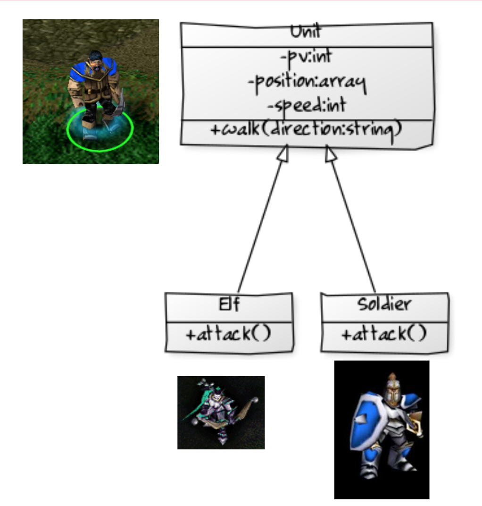

# Atelier POO 2

Créer un programme dans un fichier index.php. 
L’unité de base (classe Unit) est l’équivalent d’un paysan.

Créer les classes représentées dans le schéma UML ci-contre dans le dossier src (les flèches représentent l’héritage).
Une fois ces classes créées, les unités basiques ont une vitesse de 1 (elles se déplacent de 1 en 1).

* Les elfes ont une vitesse de 5.
* Les soldats ont une vitesse de 2.
* La position des unités est représentée par un tableau [x, y] initialisé à la position [0,0].
* La méthode walk() prend un paramètre de type string qui indique la direction ('right', 'left', 'top', 'bottom'). Uniquement ces valeurs sont autorisées.
* Lors d’un echo sur un objet, ce dernier doit afficher sa position (revoir le cours 1).
* La méthode attack() affiche juste une phrase “à l’attaque”.

